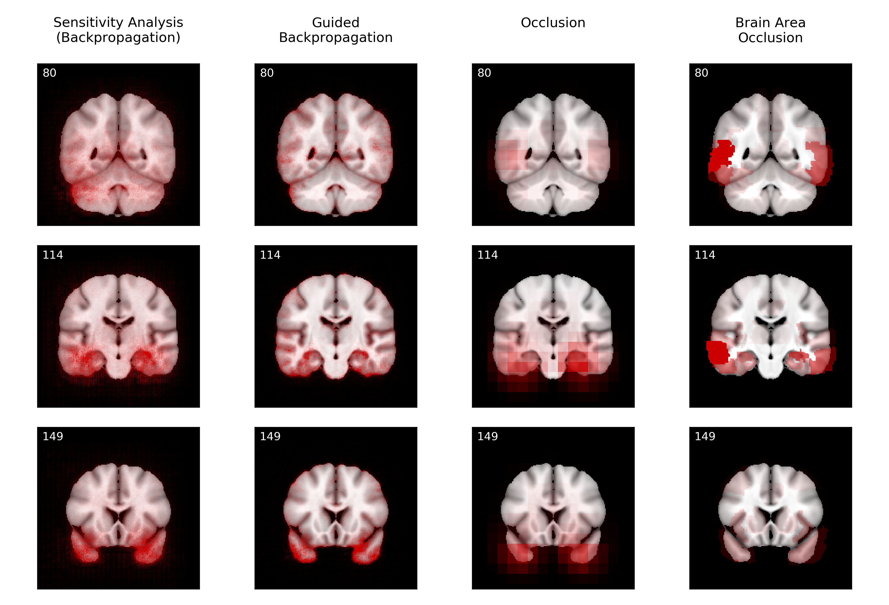
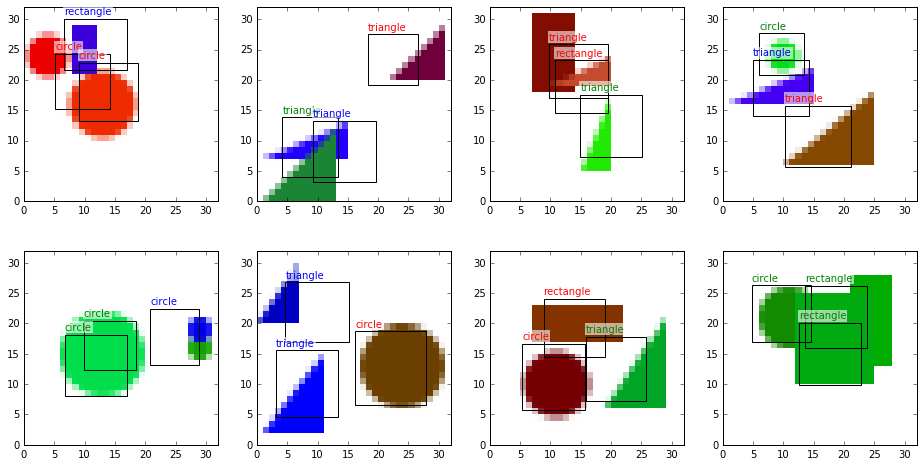

## Feedback connections for deep neural networks

with Matthew Larkum

Coming soon.

## Graph Convolutional Networks

with Thomas Kipf

Coming soon.

## Visualizing CNNs for Alzheimer's Disease

with Kerstin Ritter and Fabian Eitel (MLCN 2018)

Deep machine learning models have recently gained traction in medicine, e.g. for diagnosing diseases based on medical images. Unfortunately, these models are quite hard to interpret and verify, which is obviously a necessity in medical decision making. In this work, we train a convolutional neural network to classify Alzheimer's Disease based on MRI images of the brain, and apply some visualization methods that can explain its classification decisions.

[Paper](https://arxiv.org/abs/1808.02874) | [Code](https://github.com/jrieke/cnn-interpretability) | [Slides from MLCN 2018](https://drive.google.com/file/d/1EKHvlWq4_-NC7HQPAbZc_ZaeNZMTQwgh/view)

## Object detection tutorial

I wrote a tutorial for simple object detection with neural networks (in keras). While the approach is fairly limited and probably not usable for real-world applications, it should give a good overview of how to tackle the problem of object detection in a very simplified setting.  

[Blog post](https://towardsdatascience.com/object-detection-with-neural-networks-a4e2c46b4491) | [Code](https://github.com/jrieke/shape-detection)
