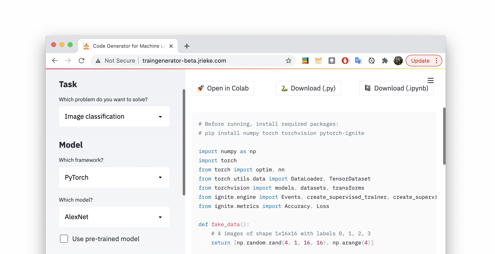

# New job at Streamlit

I recently started working as a product engineer at [Streamlit](https://streamlit.io/) and am super excited about this new role!!! 🎈

# Your year on Github 2020

Want to look back at your coding activity in 2020? I built a small web app that shows you some stats about your Github activity from last year and let's your share directly on Twitter. Try it out on the link below!

[Live version](https://gh2020.jrieke.com/) • [Code](https://github.com/jrieke/year-on-github)

# Traingenerator: Generate template code for ML

I built a web app to generate template code for machine learning. It supports PyTorch & scikit-learn, generates code for preprocessing/model setup/training/visualizations, and exports to .py, Jupyter notebook, or Google Colab. The app is built with [Streamlit](https://streamlit.io/) and entirely free! Check it out and [leave a star](https://github.com/jrieke/traingenerator) if you like it :)

[Live version](https://traingenerator.jrieke.com/) • [Code](https://github.com/jrieke/traingenerator)

# List of machine learning startups in Berlin

I compiled a list of all startups in Berlin that deal with machine learning and artificial intelligence. It also shows some metadata for each company from LinkedIn. [Check it out on Github!](https://github.com/jrieke/awesome-machine-learning-startups-berlin)

# Developing tools against Corona

Together with some friends, I took part in the WirVsVirus hackathon by the German government to develop software against Corona. We built an API that serves local information and addresses (hotlines, websites, test sites, ...), which can be integrated into other apps and websites. E.g., a tracing app could use our API to lead a user to their nearest test site in case of an infection risk. Our solution got accepted into the Solution Enabler program that followed the hackathon and is currently tested by some other projects.

[Code and Docs](https://github.com/cotect/covid-local-api)

# Master thesis: Combining evolution and learning in neural networks

*with Benjamin Grewe, João Sacramento, Maria Cervera (ETH Zürich, Institute of Neuroinformatics)*

In my master thesis, I investigated how evolution and learning interact in neural networks. This work is inspired by biological evolution, which shapes the architecture and learning processes in the brain. To this end, I evolved the architecture of networks using a simple evolutionary algorithm (inspired by [weight agnostic neural networks](https://weightagnostic.github.io/)) and trained the weights with different biologically plausible learning algorithms. 

[Thesis](https://github.com/jrieke/evolution-learning/raw/master/master-thesis-johannes-rieke-final.pdf) • [Code](https://github.com/jrieke/evolution-learning)

# Top-down feedback connections for deep neural networks

*with Matthew Larkum (Charité Berlin)*

In this research project, I integrated feedback connections into deep neural networks, inspired by the processing of top-down signals in the brain. I tested these networks on image classification with MNIST and found that feedback connections can improve classification performance and enable recovery of missing information.

[Report](https://github.com/jrieke/feedback-nns/raw/master/report.pdf) • [Code](https://github.com/jrieke/feedback-nns)

# Scalable graph convolutional networks

*with Thomas Kipf (UvA)*

Graph convolutional networks (GCNs) are a recent class of deep neural networks which operate on top of graphs. In this research project at the University of Amsterdam, I tried to improve relational GCNs and make them scalable to large knowledge graphs, by performing sampling and batching during training. Unfortunately, I couldn't reproduce the results of the exsting model. 

[Report](https://github.com/jrieke/sampled-rgcn/raw/master/report.pdf) • [Code](https://github.com/jrieke/sampled-rgcn)

# Visualizing CNNs for Alzheimer's disease

*with Kerstin Ritter and Fabian Eitel (BCAN)*

Deep machine learning models have recently gained traction in medicine, e.g. for diagnosing diseases based on medical images. Unfortunately, these models are quite hard to interpret and verify, which is obviously a necessity in medical decision making. In this work, we train a convolutional neural network to classify Alzheimer's Disease based on MRI images of the brain, and apply some visualization methods that can explain its classification decisions.

[Paper](https://arxiv.org/abs/1808.02874) • [Code](https://github.com/jrieke/cnn-interpretability) • [Slides from MLCN 2018](https://drive.google.com/file/d/1EKHvlWq4_-NC7HQPAbZc_ZaeNZMTQwgh/view)

# Object detection tutorial

I wrote a tutorial for simple object detection with neural networks (in keras). While the approach is fairly limited and probably not usable for real-world applications, it should give a good overview of how to tackle the problem of object detection in a very simplified setting.  

[Blog post](https://towardsdatascience.com/object-detection-with-neural-networks-a4e2c46b4491) • [Code](https://github.com/jrieke/shape-detection)
